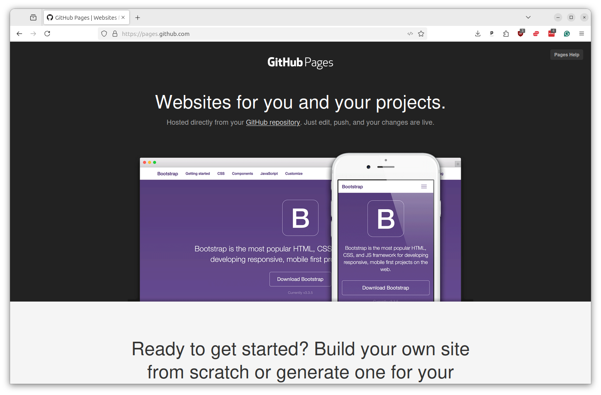
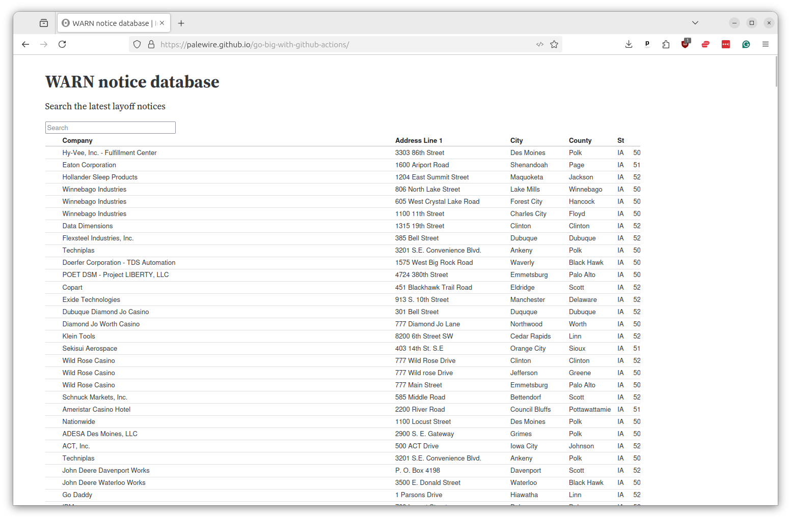

# Deploy a data dashboard

You can use Actions to do more than pull in data. You can also use it to push out data via all kinds of different publishing systems.

Examples we've worked on include:

* The Reuters system that drafts hundreds of automated charts each week [via the Datawrapper API](https://docs.google.com/presentation/d/e/2PACX-1vTFf1nR6Bs5Y41kUzv3n-ZkBWJmSeF0W7inISfvG7pfPR1BrP8VdO6bwxxVJtToKacTcxhyXcgDzyQM/pub?start=false&loop=false&delayms=3000).
* The crowdsourced dictionary of campaign-finance jargon at [moneyinpolitics.wtf](https://moneyinpolitics.wtf)
* The regularly updating database of amateur radio satellites at [amsat.org](https://www.amsat.org/amateur-satellite-index/)
* A continually updating study of [which news organizations block AI spiders](https://palewi.re/docs/news-homepages/openai-gptbot-robotstxt.html)
* A range of social media bots that post selections from a [variety](https://mastodon.palewi.re/@laxweather) of [public](https://mastodon.palewi.re/@OldLAPhotos) [resources](https://mastodon.palewi.re/@sanbornmaps)

In this chapter we'll show how you can schedule an Action to publish data to the Internet using another one GitHub's powerful tools, GitHub Pages.

[GitHub Pages](https://pages.github.com/) is a hosting service that will host files in a GitHub repository as a public website. For free. Yes, free.

Many people use Pages to host their blogs, porfolios and other personal websites. But it can be used for any app that only requires flat files like HTML, CSS and JavaScript to run.

[](https://pages.github.com/)

Data journalists can use Pages to share the information they collect with the coworkers, peers and even the general public. When combined with Actions and an automated data-gathering routine, Pages can be used to create a live dashboard that will regularly update itself with the latest data.

We'll do that by integrating the WARN notices we've scraped in previous chapters into a simple search created with Observable's Framework for building data dashboards.



This will build up to:

```yaml
name: Scrape and deploy

on:
  workflow_dispatch:

permissions:
  contents: write

jobs:
  scrape:
    name: Scrape
    runs-on: ubuntu-latest
    steps:
      - name: Checkout
        uses: actions/checkout@v4

      - name: Install Python
        uses: actions/setup-python@v5
        with:
          python-version: '3.12'

      - name: Install scraper
        run: pip install warn-scraper

      - name: Scrape
        run: warn-scraper ia --data-dir ./data/

      - name: Commit and push
        run: |
          git config user.name "GitHub Actions"
          git config user.email "actions@users.noreply.github.com"
          git add ./data/
          git commit -m "Latest data" && git push || true

      - name: upload-artifact
        uses: actions/upload-artifact@v4
        with:
          name: data
          path: ./data/

  build:
    name: Build
    runs-on: ubuntu-latest
    needs: scrape
    steps:
      - name: Checkout
        uses: actions/checkout@v4

      - name: Setup Node.js
        uses: actions/setup-node@v4
        with:
          node-version: "20.11"

      - name: Install dependencies
        run: npm install --prefix site
        shell: bash

      - name: Build
        run: npm run build --prefix site
        shell: bash

      - name: Upload release candidate
        uses: actions/upload-pages-artifact@v3
        with:
          path: "site/dist"

  deploy:
    name: Deploy
    runs-on: ubuntu-latest
    needs: build
    permissions:
      pages: write
      id-token: write
    environment:
      name: github-pages
      url: ${{ steps.deploy.outputs.page_url }}
    steps:
      - id: deploy
        name: Deploy to GitHub Pages
        uses: actions/deploy-pages@v4
```
