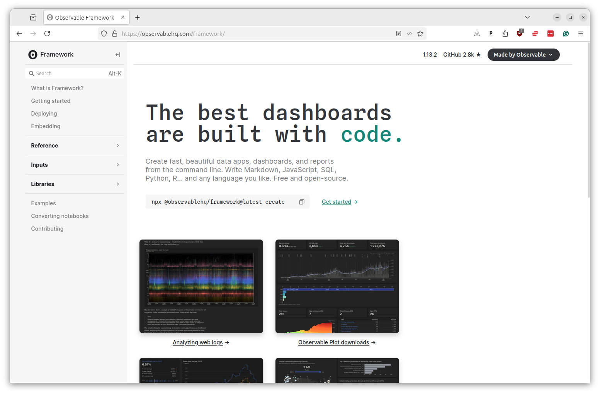
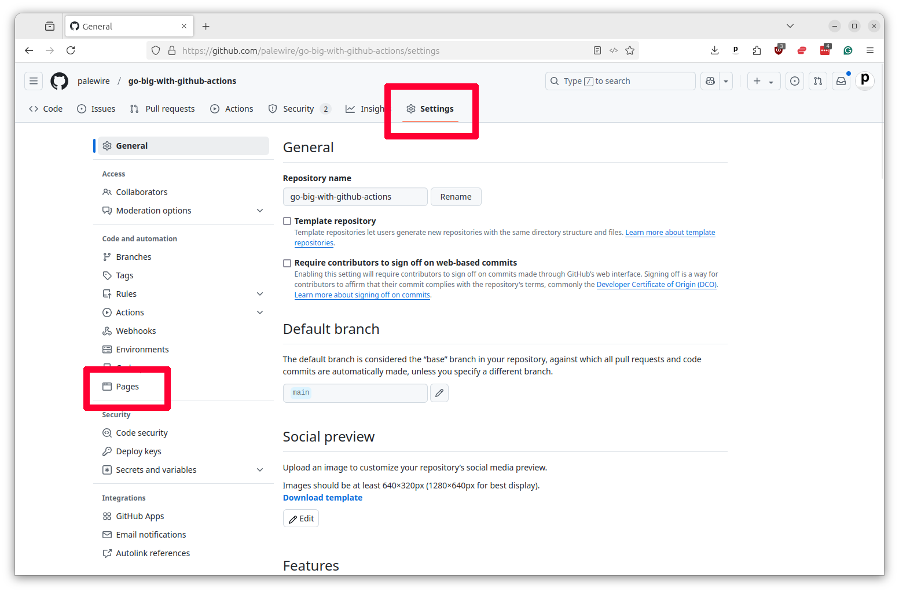
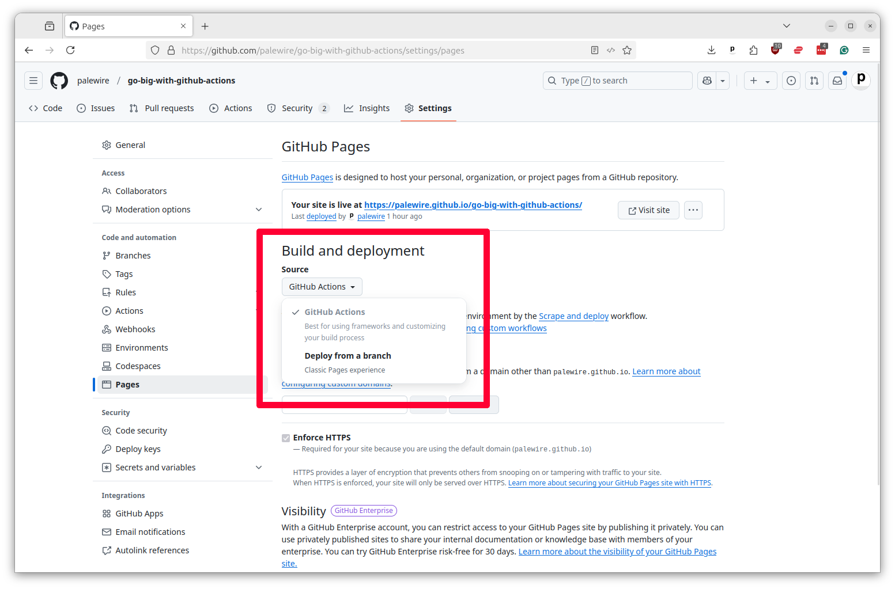
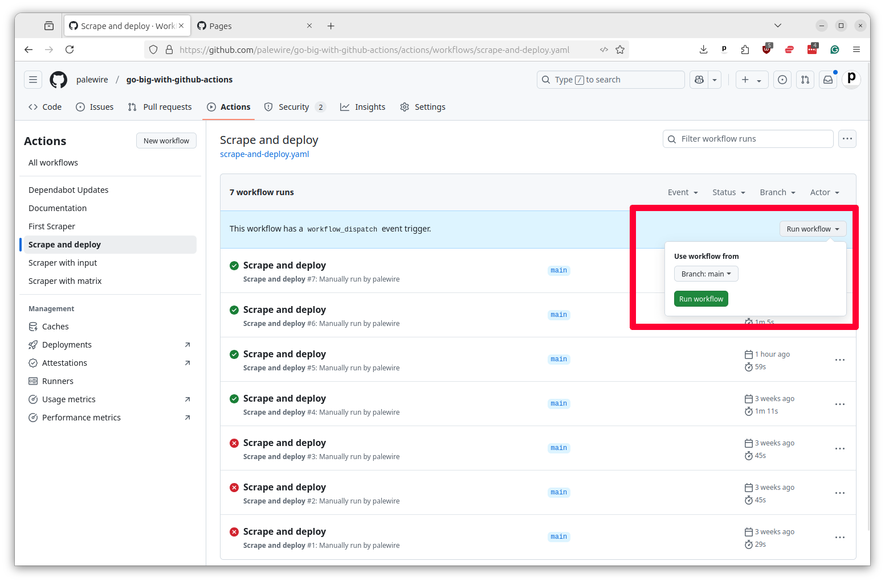
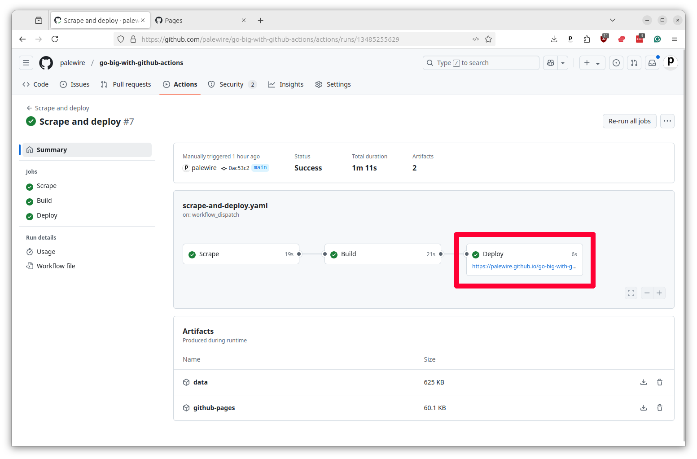

# Deploying dashboards

You can use Actions to do more than pull in data. You can also use it to push out data via all kinds of different publishing systems.

Examples we've worked on include:

* A Reuters system that drafts hundreds of automated charts each week [via the Datawrapper API](https://docs.google.com/presentation/d/e/2PACX-1vTFf1nR6Bs5Y41kUzv3n-ZkBWJmSeF0W7inISfvG7pfPR1BrP8VdO6bwxxVJtToKacTcxhyXcgDzyQM/pub?start=false&loop=false&delayms=3000).
* A crowdsourced dictionary of campaign-finance jargon at [moneyinpolitics.wtf](https://moneyinpolitics.wtf)
* A regularly updating database of [amateur radio satellites](https://www.amsat.org/amateur-satellite-index/)
* A continually updating study of [which news organizations block AI spiders](https://palewi.re/docs/news-homepages/openai-gptbot-robotstxt.html)
* A range of social media bots that post selections from [public](https://mastodon.palewi.re/@OldLAPhotos) [data](https://mastodon.palewi.re/@laxweather) [sources](https://mastodon.palewi.re/@sanbornmaps)

In this chapter we'll show how you can schedule an Action to share data using another one GitHub's powerful tools, GitHub Pages.

[GitHub Pages](https://pages.github.com/) is a free service that will host files in a GitHub repository as a public website. Yes, free.

Many people use Pages to publish their blogs, porfolios and other personal websites. But it can be used for any app that only requires flat files like HTML, CSS and JavaScript to run.

[](https://pages.github.com/)

Data journalists can use Pages to share the information they collect with their coworkers, peers and even the general public. When combined with Actions and an automated data-gathering routine, Pages can be used to create live dashboards that regularly update with the fresh data.

We'll do that now by integrating the WARN notices we've scraped in previous chapters into a simple search.


We will build the app using [Observable Framework](https://observablehq.com/framework/), an elegant JavaScript system for creating dashboards that pioneered at a company run by a former data journalist.

[](https://observablehq.com/framework/)

We don't have time to go into the details of how to build a full Observable app here, but you can find the code for the example in the `site` directory of this repository. UPDATE THIS ONCE WE FIGURE OUT HOW WE ARE GOING TO MANAGE CODE IN CLASS.

If you're interested in learning more about Framework, you should consult [Observable's documentation](https://observablehq.com/framework/getting-started) or follow the tutorial for journalists I've published [on GitHub](https://github.com/palewire/observable-framework-cpi-example).

Once you have the example site in your repository, you should create a new YAML file in your workflows folder called `scraper-and-deploy.yaml`. Remember, it needs to be in the `.github/workflows` directory of your repository next to all of your other Actions.

We will start this file off by pasting in the code similar what we used to scrape WARN data in the previous chapter.

{emphasize-lines="35-39"}
```yaml
name: Scrape and deploy

on:
  workflow_dispatch:

permissions:
  contents: write

jobs:
  scrape:
    name: Scrape
    runs-on: ubuntu-latest
    steps:
      - name: Checkout
        uses: actions/checkout@v4

      - name: Install Python
        uses: actions/setup-python@v5
        with:
          python-version: '3.12'

      - name: Install scraper
        run: pip install warn-scraper

      - name: Scrape
        run: warn-scraper ia --data-dir ./data/

      - name: Commit and push
        run: |
          git config user.name "GitHub Actions"
          git config user.email "actions@users.noreply.github.com"
          git add ./data/
          git commit -m "Latest data" && git push || true

      - name: upload-artifact
        uses: actions/upload-artifact@v4
        with:
          name: data
          path: ./data/
```

There's little new in this first task. It will simply scrape the latest WARN data from Iowa's website and commits it to the repository. But pay attention to that final step, where we upload the data as an artifact. This will attach everything in the data folder to the Action so it can be used in later steps.

Before we can move to start working with GitHub Pages, you will need to activate the service in your repository. To do this, go to by clicking on the Settings tab and then selecting Pages from the left-hand toolbar.



Next you should select the Source pulldown in the Build and Deployment section and choose GitHub Actions.



Now Pages is ready to run.

Head back to your workflow file and insert a second step at the bottom named `Build`. It will be tasked with using Observable Framework to create a bundle of data and code that's ready to be served up as a website.

We can start with the standard step of checking out the code. Notice that the step `needs` the scrape step, which ensures that it will not run until our first step has finished.

{emphasize-lines="4"}
```yaml
  build:
    name: Build
    runs-on: ubuntu-latest
    needs: scrape
    steps:
      - name: Checkout
        uses: actions/checkout@v4
```

Unlike our WARN notice scraper, Observable Framework uses the Node.js programming language. So we need to install that instead of Python to run the build. We'll do that using pre-packaged [actions/setup-node](https://github.com/actions/setup-node) shortcut offered by GitHub and the `npm` package manager, which amount to the Node.js equivalent of the tools we used for Python in our scraping step.

{emphasize-lines="9-15"}
```yaml
  build:
    name: Build
    runs-on: ubuntu-latest
    needs: scrape
    steps:
      - name: Checkout
        uses: actions/checkout@v4

      - name: Setup Node.js
        uses: actions/setup-node@v4
        with:
          node-version: "20.11"

      - name: Install dependencies
        run: npm install --prefix site
```

Add a step to download the data we scraped in the previous step. This is done using the [actions/download-artifact](https://github.com/actions/download-artifact) companion to the uploader. We will instruct it to unzip the files in a special directory we've set aside in our Observable Framework configuration for its data sources.

{emphasize-lines="17-21"}
```yaml
  build:
    name: Build
    runs-on: ubuntu-latest
    needs: scrape
    steps:
      - name: Checkout
        uses: actions/checkout@v4

      - name: Setup Node.js
        uses: actions/setup-node@v4
        with:
          node-version: "20.11"

      - name: Install dependencies
        run: npm install --prefix site

      - name: Download data
        uses: actions/download-artifact@v4
        with:
          name: data
          path: site/src/data/
```

Add another step that will run Observable Framework's custom command for building the app. This will take the data we downloaded and create a bundle of HTML, CSS and JavaScript that can be served up as a website in the `site/dist` directory.

{emphasize-lines="23-24"}
```yaml
  build:
    name: Build
    runs-on: ubuntu-latest
    needs: scrape
    steps:
      - name: Checkout
        uses: actions/checkout@v4

      - name: Setup Node.js
        uses: actions/setup-node@v4
        with:
          node-version: "20.11"

      - name: Install dependencies
        run: npm install --prefix site

      - name: Download data
        uses: actions/download-artifact@v4
        with:
          name: data
          path: site/src/data/

      - name: Build
        run: npm run build --prefix site
```

Finally, we need to add a step that will upload the built files to the Action so they can be used in the next step. This is done using the [actions/upload-pages-artifact](https://github.com/actions/upload-pages-artifact), a shortcut created by GitHub to make it easier to work with Pages.

{emphasize-lines="26-29"}
```yaml
  build:
    name: Build
    runs-on: ubuntu-latest
    needs: scrape
    steps:
      - name: Checkout
        uses: actions/checkout@v4

      - name: Setup Node.js
        uses: actions/setup-node@v4
        with:
          node-version: "20.11"

      - name: Install dependencies
        run: npm install --prefix site

      - name: Download data
        uses: actions/download-artifact@v4
        with:
          name: data
          path: site/src/data/

      - name: Build
        run: npm run build --prefix site

      - name: Upload release candidate
        uses: actions/upload-pages-artifact@v3
        with:
          path: "site/dist"
```

This will attach the files in the `site/dist` directory to the Action so they can be published in the final step.

GitHub's documentation provides a ready-to-use example that requires very little customization. You only need to paste it into your workflow and make sure that the `needs` line is set to the slug of your build step.

{emphasize-lines="4"}
```yaml
  deploy:
    name: Deploy
    runs-on: ubuntu-latest
    needs: build
    permissions:
      pages: write
      id-token: write
    environment:
      name: github-pages
      url: ${{ steps.deploy.outputs.page_url }}
    steps:
      - id: deploy
        name: Deploy to GitHub Pages
        uses: actions/deploy-pages@v4
```

That's all it should take. You should save your workflow file and commit it your repository. Once it's been pushed to GitHub you should be able to see it in the Actions tab of your repository. You can run it manually by clicking on the Run workflow button.



After the task finishes, your dashboard should be available at the URL `https://<your-username>.github.io/<your-repo-name>/`. You can find the link in the Pages tab of your repository settings and it should appear in the Deploy box in your job's summary page.



Hit the link and you should see the dashboard we built in the `site` directory of this repository.


Congratulations. You've deployed a dashboard using GitHub Pages. To schedule it to automatically update, all you'd need to do is schedule the workflow to run on a regular basis as we did in previous chapters.


{emphasize-lines="5-6"}
```yaml
name: Scrape and deploy

on:
  workflow_dispatch:
  schedule:
    - cron: "0 0 * * *"
```
