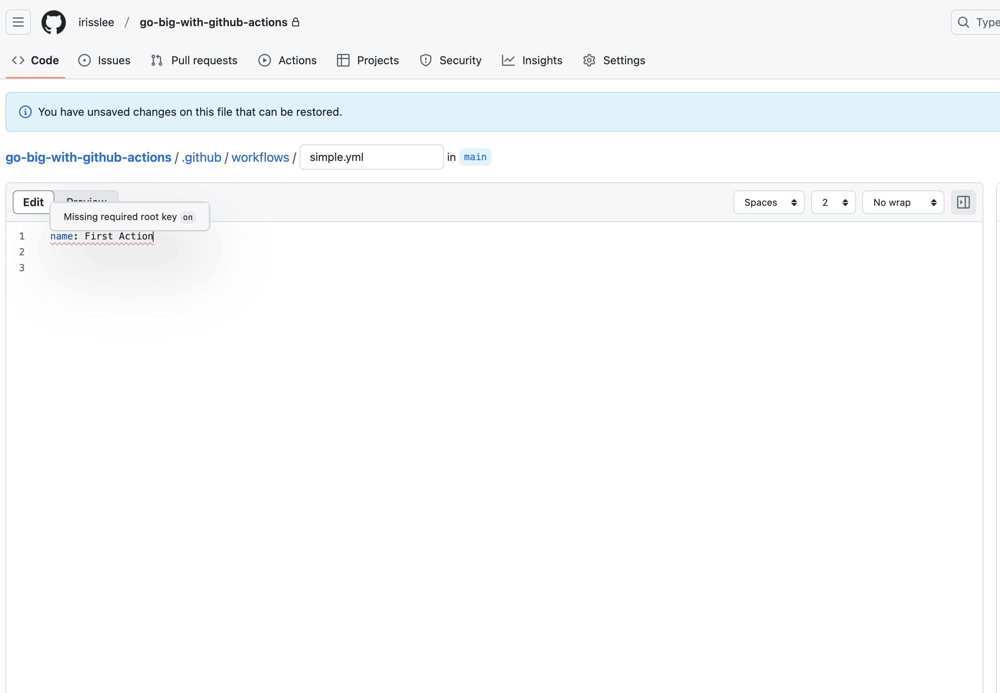
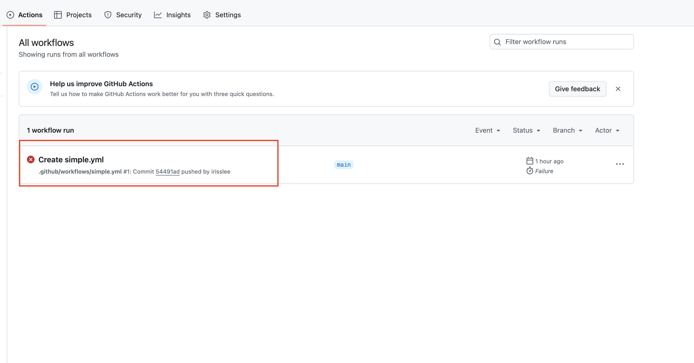

# Your first Action
This chapter will show you how to create your first Action on GitHub

## Create a simple Action

Navigate back to your repository in the browser. Click on the Actions tab. This will take you to Actions page. 


Scrolling down the Actions page, you will see that GitHub has templates for all kinds of automations. You can also search to see if an automation template already exists. For our first action we will be choosing `set up a workflow yourself` in blue


Let's star by renaming the file to `simple.yaml`


## Start writing your workflow file in YAML

Let's go down the file and start writing our YAML file. First we will name our action by adding the following to line up top.

```yaml
name: First Action
```

You will notice the red squiggle under line. This means something is wrong or missing with your actions. When you hover a help text will appear.



Let's follow the help text add one more line under `name`. 

```yaml
on: 
  workflow_dispatch:
```

`on` is used to determine when the Action file will run. `workflow_dispatch` means the Action can be run manually and accept inputs if any. You can read more about different options for `on` [here](https://docs.github.com/en/actions/writing-workflows/workflow-syntax-for-github-actions#on).

Let's go ahead and commit this workflow


Alas! There was an error. Click on the error message to see what happened.



Looks like our Action file was incomplete - it's missing some key elements like `jobs`. We can open the workflow file again by clicking on `Code`.


In GitHub, all workflow files are saved under `.github > workflows` folder. When you are ready to add more wokflow files locally, you will have to add them to this folder.


Click into your `simple.yml` file and the pencil icon on the top right coner to edit the files again.


Let's fill out rest of the workflow. Copy and paste the below code under `workflow_dispatch:`. As you fill out the rest of the file. Be mindful of indentation and syntax errors - the red squiggly marks will give you a hint about what's wrong with the file. At any point if you would like to add comments, you can do so by adding `#` in the front.

```yaml
jobs:
  scrape:
    name: Scrape
    runs-on: ubuntu-latest
    steps:
      name: Hello world
      run: echo "Hello world"
```

Your final workflow file will look something like this.

```yaml
name: First Action

on:
  workflow_dispatch:

# jobs to run
jobs:
  scrape:
    name: Scrape
    runs-on: ubuntu-latest
    steps:
      - name: Hello world
        run: echo "Hello world"
```

## Breakdown

{emphasize-lines="7"}
```yaml
name: First Action

on:
  workflow_dispatch:

jobs:
  scrape:
    name: Scrape
    runs-on: ubuntu-latest
    steps:
      - name: Hello world
        run: echo "Hello world"
```