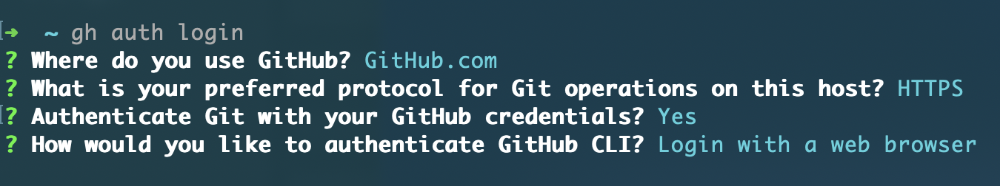

# Getting started

This chapter will walk you through creating a repository hosted in GitHub.

## Get started on GitHub

If you already have your own GitHub account, please log in. If you do not have oneplease create an account on [Github](https://github.com) and log in to the site.

Once you are logged into GitHub, create a new repository by clicking on the NEW button on top left corner or simply click this link [https://github.com/new](https://github.com/new).

Once on the page, fill in the name for your repository - go-big-with-github-actions - for example, and click on the Create Repository button at the bottom. 


## Clone the repository to your local machine

Using the terminal, navigate to FOLDER in your machine. 

```bash
cd FOLDER_NAME
```

If you have the [Github CLI tool](https://formulae.brew.sh/formula/gh), you can clone the forked repo into your computer by using terminal commands below. 

First login to github

```bash
gh auth login
```
Follow the instructions on you screen and log in to Github. We suggest the following answers if you have not used `gh` before - this will allow you to login through the browser with a one-time code.



Then clone your repository to your local computer

```bash
gh repo clone https://github.com/<your-username>/<your-repo>
```

After clone completes, run the `ls` command again. You should see a new folder created by `gh`.

```bash
ls
```

Use `cd` to move into the directory, where we can begin work.

```bash
cd <your-repo-path>
```

From here you can start a code editor in your directory by typing. You can also create action files in the browser as well.

```bash
code .
```