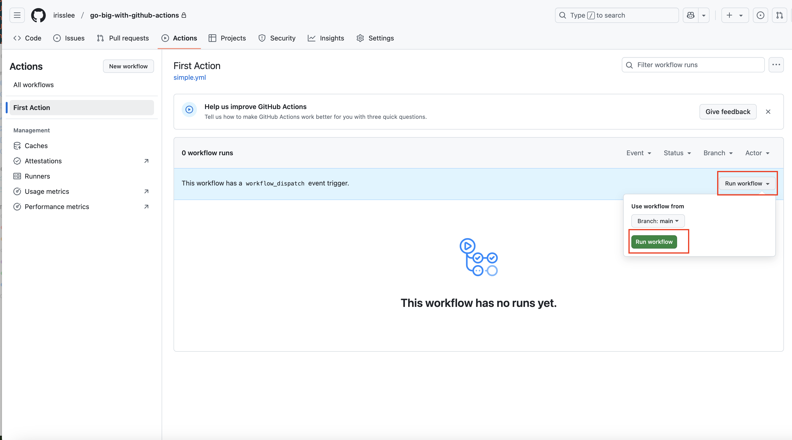

# Creating your first Action

This chapter will walk you through creating a repository hosted in GitHub and creating your first Action.

## Get started on GitHub

If you already have a GitHub account, please log in. If you do not have one, please create one on [github.com](https://github.com) and use it to log in to the site.

Once you are logged into GitHub, create a new repository by clicking on the "New" button at the top-left corner or simply click this link: [github.com/new](https://github.com/new).

Now, fill in a name for your new repository. A good example would be `go-big-with-github-actions`. Click on the "Create repository" button at the bottom of the form.


## Create a simple Action

Navigate to your repository's homepage in the browser. Click on the "Actions" tab, which will take you to a page where you can create, manage and monitor your Actions.


Scroll down the page. You will see that GitHub offers a menu of templates for common automation tasks. For our first Action, we will click "set up a workflow yourself" link near the top of the page.

:::{admonition} Note
The terms action, workflow, job and task and yaml are often used interchangeably by GitHub Actions users to refer to these configuration files.
:::


This will open up an editor inside of your browser, which is another one of the features offered by GitHub.

Let's start by renaming the file to `simple.yaml` in the box above the editor. This will be the name of your first Action file.


:::{admonition} Note
We will be editing our files inside of GitHub using our browser in this manner throughout the tutorial. If you're already a GitHub expert and you'd prefer to clone your repo and use a code editor instead, please feel free to do so. Just make sure to push your changes back to GitHub as you go.
:::

## Start your workflow

First, we will name our Action by adding the following line at the top of the file.

```yaml
name: First Action
```

You will notice a red squiggly underline beneath your code. This means that GitHub sees something wrong with your workflow. When you hover over the squiggly line, a hint will appear. Here we see it says "Missing required root key `on`."


Let's take the hint add another line under `name`.

```yaml
on:
  workflow_dispatch:
```

They keyword `on` is used to determine when the Action file will run. When it is configured with `workflow_dispatch`, the Action can be run manually from the monitoring panel.

:::{admonition} Note
You can read more about different options for configuring `on` [in GitHub's documentation](https://docs.github.com/en/actions/writing-workflows/workflow-syntax-for-github-actions#on).
:::

Now let's tell our workflow what we want it to do.

Copy and paste the below code under `workflow_dispatch:`.

```yaml
jobs:
  hello:
    name: Say Hello
    runs-on: ubuntu-latest
    steps:
      name: Hello world
      run: echo "Hello world"
```

Be mindful of indentation and uneven syntax. The red squiggly marks will give you hints is there's anything wrong with your file.

Your workflow file should now look something like this:

```yaml
name: First Action

on:
  workflow_dispatch:

jobs:
  hello:
    name: Say Hello
    runs-on: ubuntu-latest
    steps:
      - name: Hello world
        run: echo "Hello world"
```

A workflow run consists of one or more `jobs`, which can run sequentially or in parallel depending on your configuration. In this simple case we only have a single job called `hello`.

{emphasize-lines="6-7"}
```yaml
name: First Action

on:
  workflow_dispatch:

jobs:
  hello:
    name: Say Hello
    runs-on: ubuntu-latest
    steps:
      - name: Hello world
        run: echo "Hello world"
```

For each job, you will need to choose what kind of server to use. In our case, we selected an Ubuntu Linux runner. You can also choose MacOS or Windows.

{emphasize-lines="9"}
```yaml
name: First Action

on:
  workflow_dispatch:

jobs:
  hello:
    name: Say Hello
    runs-on: ubuntu-latest
    steps:
      - name: Hello world
        run: echo "Hello world"
```

:::{admonition} Note
While Actions is free up to 2,000 minutes per month, the fees incurred at higher usage levels [vary](https://docs.github.com/en/billing/managing-billing-for-your-products/managing-billing-for-github-actions/about-billing-for-github-actions#minute-multipliers) depending on the runner you choose. Ubuntu runners are the least expensive.
:::

Each job then runs as many `steps` as you want to layout as a list. Give each task a name and tell it what to do. In our case, we are simply printing out "Hello world" to the console using the built-in [`echo`](https://linux.die.net/man/1/echo) command.

{emphasize-lines="10-12"}
```yaml
name: First Action

on:
  workflow_dispatch:

jobs:
  hello:
    name: Say Hello
    runs-on: ubuntu-latest
    steps:
      - name: Hello world
        run: echo "Hello world"
```


Now save you file to the repository by clicking on the green "Commit changes" button in the top-right corner.


In GitHub, all workflow files are saved under `.github > workflows` folder. Your first commit has created the folder and saved your first workflow for you. When you are ready to add more workflows, you should add them to this folder as well.


If you need to edit this first file again, simply click into the file and click the pencil icon on the top right corner.


## Run your action

Go back to your "Actions" tab in the repository. You will see that your workflow is now available in the left rail. Click on its name there. Then go to the right corner where you will see a dropdown called "Run workflow." Click the second, green "Run workflow" button it presents in a dropdown to kickstart your first job.



Refresh your browser. Once your Action has been completed, you will see a green checkmark to the left. Clicking on the completed action will show you what job just ran. Click on the job and open up the steps within workflow to see the output.


