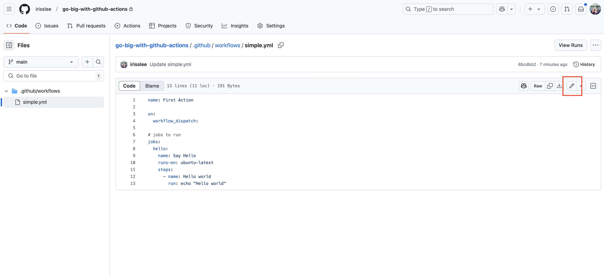
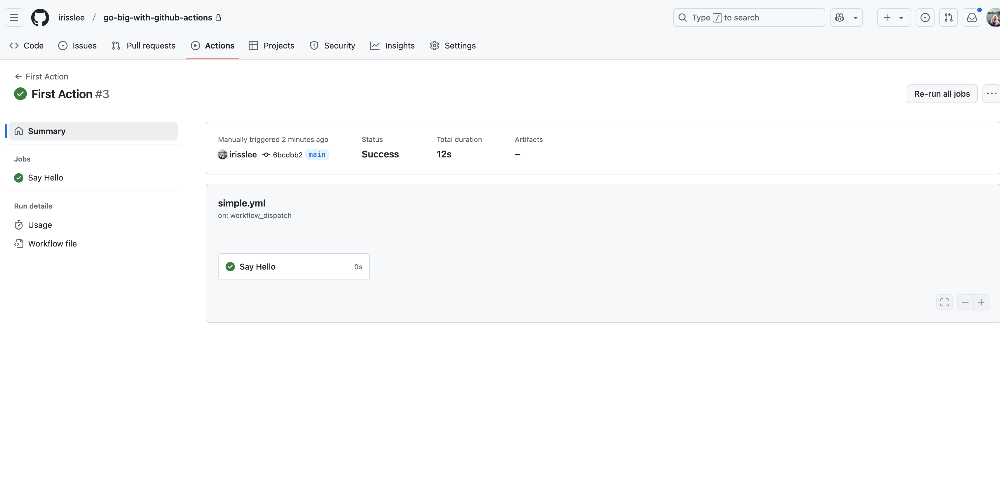

# Creating an Action

This chapter will walk you through creating a repository hosted in GitHub and creating your first Action

## Get started on GitHub

If you already have your own GitHub account, please log in. If you do not have one, please create an account on [Github](https://github.com) and log in to the site.

Once you are logged into GitHub, create a new repository by clicking on the NEW button on top left corner or simply click this link [https://github.com/new](https://github.com/new).

Once on the page, fill in the name for your repository - go-big-with-github-actions - for example, and click on the Create Repository button at the bottom.


## Create a simple Action

We will be editing our files in the browser inside GitHub. But if you'd rather clone your repo and use a code editor instead, that's fine too.

**Action(s)** and **Workflow** will be used interchangeably.
**Action file**, **Workflow file**, **Yaml file** are all the same.

Navigate back to your repository in the browser. Click on the Actions tab. This will take you to Actions page.


Scrolling down the Actions page, you will see that GitHub has templates different automation tasks. For our first Action, we will be choosing `set up a workflow yourself` in blue


This will open up a YAML file editor inside of your browser. Let's star by renaming the file to `simple.yaml`


## Start writing your workflow file in YAML

First we will name our action by adding the following to line up top.

```yaml
name: First Action
```

You will notice the red squiggly underline. In the browser editor, this means something is wrong or missing with your actions. When you hover over the squiggly line, a help text will appear.


Let's follow the help text add one more line under `name`.

```yaml
on:
  workflow_dispatch:
```

`on` is used to determine when the Action file will run. `workflow_dispatch` means the Action can be run manually and accept inputs if any. You can read more about different options for `on` [here](https://docs.github.com/en/actions/writing-workflows/workflow-syntax-for-github-actions#on).

Let's fill out rest of the workflow. Copy and paste the below code under `workflow_dispatch:`. As you fill out the rest of the file. Be mindful of indentation and syntax errors - the red squiggly marks will give you a hint about what's wrong with the file. At any point if you would like to add comments, you can do so by adding `#` in the front.

```yaml
jobs:
  hello:
    name: Say Hello
    runs-on: ubuntu-latest
    steps:
      name: Hello world
      run: echo "Hello world"
```

Your final workflow file will look something like this.

```yaml
name: First Action

on:
  workflow_dispatch:

# jobs to run
jobs:
  hello:
    name: Say Hello
    runs-on: ubuntu-latest
    steps:
      - name: Hello world
        run: echo "Hello world"
```

Let's go ahead and commit the file


In GitHub, all workflow files are saved under `.github > workflows` folder. Your first commit has created the folder and saved your first Action file for you. When you are ready to add more wokflow files locally, you will need to add them to this folder.


At any point if you need to edit the file again, simply click into the file and click the pencil icon on the top right corner.




## The Breakdown

A workflow run consists of multiple `jobs`. You can have more than one job. In our case we only have a single job called `hello`. Jobs can run sequentially or in parallel depending on your configuration.

{emphasize-lines="6-7"}
```yaml
name: First Action

on:
  workflow_dispatch:

jobs:
  hello:
    name: Say Hello
    runs-on: ubuntu-latest
    steps:
      - name: Hello world
        run: echo "Hello world"
```

For each job, you will need to choose what kind of runner it will us. In our case, chose a Linux runner. You can also choose MacOS or Windows. Actions are free, but if you are paying for them to use beyond the storage and minute limits, you will be [charged differently](https://docs.github.com/en/billing/managing-billing-for-your-products/managing-billing-for-github-actions/about-billing-for-github-actions#minute-multipliers) depending on your runner.

{emphasize-lines="9"}
```yaml
name: First Action

on:
  workflow_dispatch:

jobs:
  hello:
    name: Say Hello
    runs-on: ubuntu-latest
    steps:
      - name: Hello world
        run: echo "Hello world"
```

Each job is likely to have multiple tasks. The `steps` lay out those tasks in a list format. Give each task a name and details.

{emphasize-lines="10-12"}
```yaml
name: First Action

on:
  workflow_dispatch:

jobs:
  hello:
    name: Say Hello
    runs-on: ubuntu-latest
    steps:
      - name: Hello world
        run: echo "Hello world"
```

## Run your action

Let's go back to your `action` tab in the repository. You will see that your action is now populated on the left rail. Choose your action then go to the right corner where you will see a dropdown called `Run workflow`. This workflow will run on our `main` branch - click the green Run `workflow button` to run your first action!


Refresh your browser to see your progress. Once your Action has been completed, you will see a green checkmark to the left. Clicking on the completed action will show you what job just ran -  `Say Hello`. Click on the job and open up the steps within workflow to see the output.


