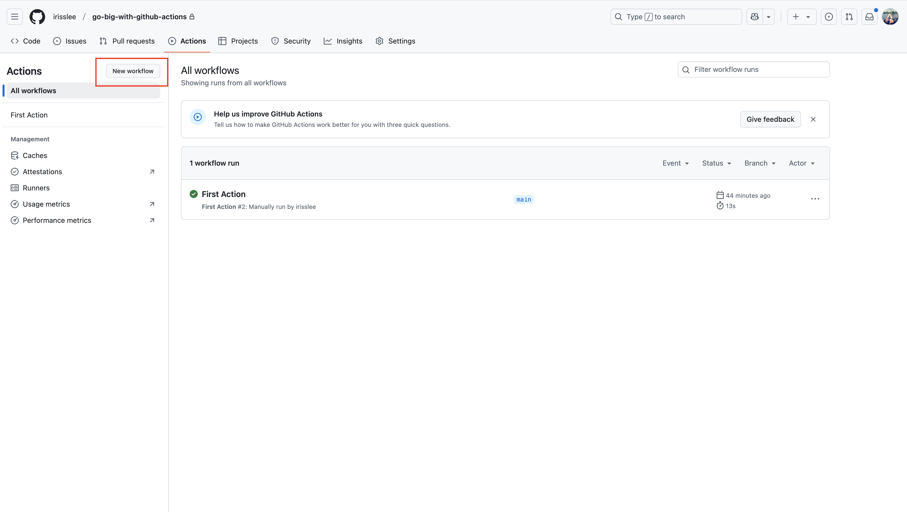
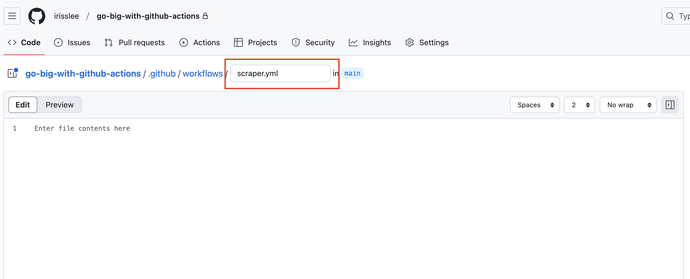
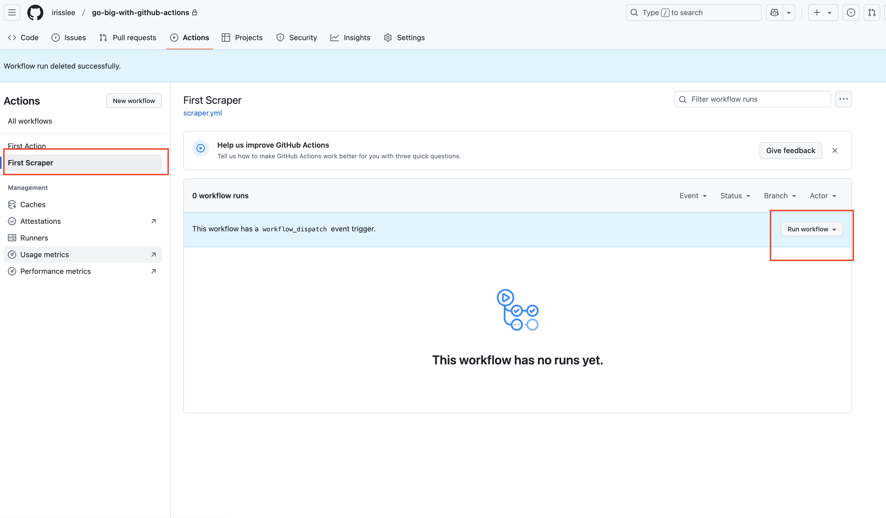
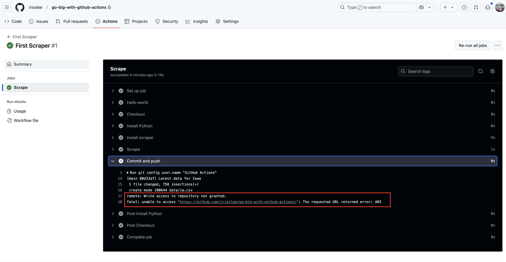
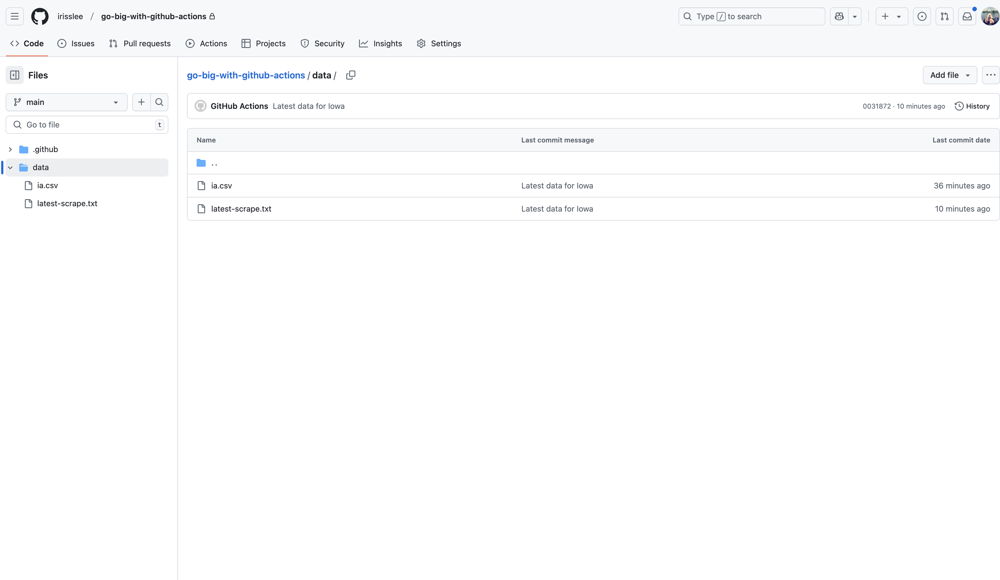
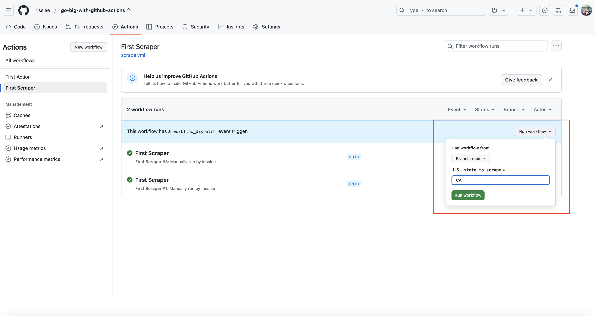
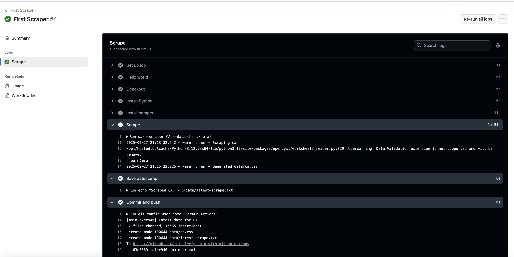

# Scraping data on a schedule

A web scraper is a computer script that can extract data from a website and store it in a structured format. It's one of the most common ways to collect information from the web and a favorite tool of data journalists.

Since the web constantly updates, scrapers must run regularly to keep the data fresh. Scheduling routine tasks on a personal computer can be unreliable, and many cloud services can be expensive or difficult to configure. And then there's the tricky bit of figuring out where you'll store the data.

This is an area where GitHub Actions can help. Building on the fundamentals we covered in the previous chapter, we can schedule a workflow that will run a web scraper and store the results in our repository — for free!

Examples of Actions scrapers that we've worked on include:

- The Reuters system that extracts the famous ['dot plot' economic projections](https://github.com/palewire/fed-dot-plot-scraper) issued by the U.S. Federal Reserve
- Dozens of [COVID-19 data scrapers](https://github.com/datadesk/california-coronavirus-scrapers) developed at the Los Angeles Times
- A routine that collects and parses [animal welfare inspections](https://github.com/data-liberation-project/aphis-inspection-reports) conducted by the U.S. Department of Agriculture

## Create a new workflow

Let's begin by starting a new workflow file. Go to your repository's homepage in the browser. Click on the "Actions" tab, which will take you to a page where you manage Actions. Now click on the "New workflow" button.



This time let's call this file `scraper.yml`.



## Write your workflow file

Start with a `name` and expand the `on` parameter we used last time by adding a `cron` setting. Here, we've added a crontab expression that will run the Action everyday at 00:00 UTC.


{emphasize-lines="5-6"}
```yaml
name: First Scraper

on:
  workflow_dispatch:
  schedule:
  - cron: "0 0 * * *"
```

:::{admonition} Note
[Crons](https://en.wikipedia.org/wiki/Cron), sometimes known as crontabs or cron jobs, are a way to schedule tasks for particular dates and times. They are a powerful tool, but a bit tricky to understand. If you need help writing a new pattern, try using [crontab.guru](https://crontab.guru/).
:::

Next, add a simple job named `scrape`.

{emphasize-lines="8-12"}
```yaml
name: First Scraper

on:
  workflow_dispatch:
  schedule:
  - cron: "0 0 * * *"

jobs:
  scrape:
    name: Scrape
    runs-on: ubuntu-latest
    steps:
```

Think of Actions as renting a blank computer from GitHub. In order to use it, you will need to install the latest version of whatever language you are using, as well as any corresponding package managers and libraries.

Because these Actions are used so often, GitHub has a [marketplace](https://github.com/marketplace?type=actions) where you can find pre-packaged steps for common task.

The `checkout` action clones our repository onto the server so that all subsequent steps can access to it. We will need to do this so that we can save our the scraped data back into the repo at the end of the workflow.

{emphasize-lines="13-14"}
```yaml
name: First Scraper

on:
  workflow_dispatch:
  schedule:
  - cron: "0 0 * * *"

jobs:
  scrape:
    name: Scrape
    runs-on: ubuntu-latest
    steps:
      - name: Checkout
        uses: actions/checkout@v4
```

Our scraper will gather the latest mass layoff notices posted on government websites according to the requirements of the U.S. Worker Adjustment and Retraining Notification Act, also known as the WARN Act. It's an open-source software package developed by [Big Local News](https://biglocalnews.org/content/tools/layoff-watch.html) that relies on the Python computer programming language.

So our next step is to install Python, which can also be accomplished with a pre-packaged action.

{emphasize-lines="16-19"}
```yaml
name: First Scraper

on:
  workflow_dispatch:
  schedule:
  - cron: "0 0 * * *"

jobs:
  scrape:
    name: Scrape
    runs-on: ubuntu-latest
    steps:
      - name: Checkout
        uses: actions/checkout@v4

      - name: Install Python
        uses: actions/setup-python@v5
        with:
          python-version: '3.12'
```

Now we will use Python's `pip` package manager to install the `warn-scraper` package.

{emphasize-lines="21-22"}
```yaml
name: First Scraper

on:
  workflow_dispatch:
  schedule:
  - cron: "0 0 * * *"

jobs:
  scrape:
    name: Scrape
    runs-on: ubuntu-latest
    steps:
      - name: Checkout
        uses: actions/checkout@v4

      - name: Install Python
        uses: actions/setup-python@v5
        with:
          python-version: '3.12'

      - name: Install scraper
        run: pip install warn-scraper
```

According to the package's [documentation](https://warn-scraper.readthedocs.io/en/latest/usage.html), all we need to do to scrape a state's notices is to type `warn-scraper <state>` into the terminal.

Let's scrape Iowa, America's greatest state, and store the results int `./data/` folder at the root of our repository.

{emphasize-lines="24-25"}
```yaml
name: First Scraper

on:
  workflow_dispatch:
  schedule:
  - cron: "0 0 * * *"

jobs:
  scrape:
    name: Scrape
    runs-on: ubuntu-latest
    steps:
      - name: Checkout
        uses: actions/checkout@v4

      - name: Install Python
        uses: actions/setup-python@v5
        with:
          python-version: '3.12'

      - name: Install scraper
        run: pip install warn-scraper

      - name: Scrape
        run: warn-scraper ia --data-dir ./data/
```

Finally, we want to commit this scraped data to the repository and push it back to GitHub.

{emphasize-lines="30-35"}
```yaml
name: First Scraper

on:
  workflow_dispatch:
  schedule:
  - cron: "0 0 * * *"

jobs:
  scrape:
    name: Scrape
    runs-on: ubuntu-latest
    steps:
      - name: Checkout
        uses: actions/checkout@v4

      - name: Install Python
        uses: actions/setup-python@v5
        with:
          python-version: '3.12'

      - name: Install scraper
        run: pip install warn-scraper

      - name: Scrape
        run: warn-scraper ia --data-dir ./data/

      - name: Commit and push
        run: |
          git config user.name "GitHub Actions"
          git config user.email "actions@users.noreply.github.com"
          git add ./data/
          git commit -m "Latest data for Iowa" && git push || true
```

Save this workflow to our repo. Go to `Actions` tab and choose your scraper workflow and click `Run workflow` as we did in the previous chapter.



Once the task has been completed, click its list item for a summary report. You will see that Action was unable to access the repository. This is because GitHub Actions requires that you provide [permissions](https://docs.github.com/en/actions/writing-workflows/workflow-syntax-for-github-actions#permissions).



Let's go ahead an add the below line between on and jobs so that we provide write permission to all jobs.

{emphasize-lines="8-9"}
```yaml
name: First Scraper

on:
  workflow_dispatch:
  schedule:
  - cron: "0 0 * * *"

permissions:
  contents: write

jobs:
  scrape:
    name: Scrape
    runs-on: ubuntu-latest
    steps:
      - name: Checkout
        uses: actions/checkout@v4

      - name: Install Python
        uses: actions/setup-python@v5
        with:
          python-version: '3.12'

      - name: Install scraper
        run: pip install warn-scraper

      - name: Scrape
        run: warn-scraper ia --data-dir ./data/

      - name: Commit and push
        run: |
          git config user.name "GitHub Actions"
          git config user.email "actions@users.noreply.github.com"
          git add ./data/
          git commit -m "Latest data for Iowa" && git push || true
```

Save the file and run the Action again.

Once the workflow has been completed, you should see the `ia.csv` file in your repository's `data` folder.



## User-defined inputs

Github Actions allows you to specify `inputs` for manually triggered workflows, which we can use to allow users to specify what state to scrape.

To add an input option to your workflow, go to your yaml file and add the following lines. Here, we are asking Actions to create an `input` called `state` (there can be more than one inputs in a given Action).

If you need more control over your inputs, you can also add [choices](https://docs.github.com/en/actions/writing-workflows/workflow-syntax-for-github-actions#onworkflow_dispatchinputs).

{emphasize-lines="4-9"}
```yaml
name: First Scraper

on:
  workflow_dispatch:
    inputs:
      state:
        description: 'U.S. state to scrape'
        required: true
        default: 'ia'
  schedule:
  - cron: "0 0 * * *"
```

Once your input field has been configured, let's change our warn-scraper command so that whatever we input as `state` will reflect on the scrape command.

```yaml
      - name: Scrape
        run: warn-scraper ${{ inputs.state }} --data-dir ./data/
```

### Customize your commit message

You can add these inputs anywhere! Add them to your commit message for accuracy.

```yaml
      - name: Commit and push
        run: |
          git config user.name "GitHub Actions"
          git config user.email "actions@users.noreply.github.com"
          git add ./data/
          git commit -m "Latest data for ${{ inputs.state }}" && git push || true
```
### Add a datestamp

Github may automatically [disable workflows](https://docs.github.com/en/actions/managing-workflow-runs-and-deployments/managing-workflow-runs/disabling-and-enabling-a-workflow) if there's period of inactivity.
To get around this you can can have your workflow commit an updated text file every time your Action runs.

```yaml
      - name: Save datestamp
        run: date > ./data/latest-scrape.txt
```

## Final steps

Your final file should look like this.

```yaml
name: First Scraper

on:
  workflow_dispatch:
    inputs:
      state:
        description: 'U.S. state to scrape'
        required: true
        default: 'ia'
  schedule:
  - cron: "0 0 * * *"

permissions:
  contents: write

jobs:
  scrape:
    name: Scrape
    runs-on: ubuntu-latest
    steps:
      - name: Hello world
        run: echo "Scraping data for ${{ inputs.state }}"

      - name: Checkout
        uses: actions/checkout@v4

      - name: Install Python
        uses: actions/setup-python@v5
        with:
          python-version: '3.12'

      - name: Install scraper
        run: pip install warn-scraper

      - name: Scrape
        run: warn-scraper ${{ inputs.state }} --data-dir ./data/

      - name: Save datestamp
        run: date > ./data/latest-scrape.txt

      - name: Commit and push
        run: |
          git config user.name "GitHub Actions"
          git config user.email "actions@users.noreply.github.com"
          git add ./data/
          git commit -m "Latest data for ${{ inputs.state }}" && git push || true
```

Let's run the Action again. Now when you go to run your Action, you will see an input field. This will allow you to specify what which state to scrape for. Here I'm choosing CA.



Upon completion you will see that steps that reference `inputs.state` have been run with the correctly value.


