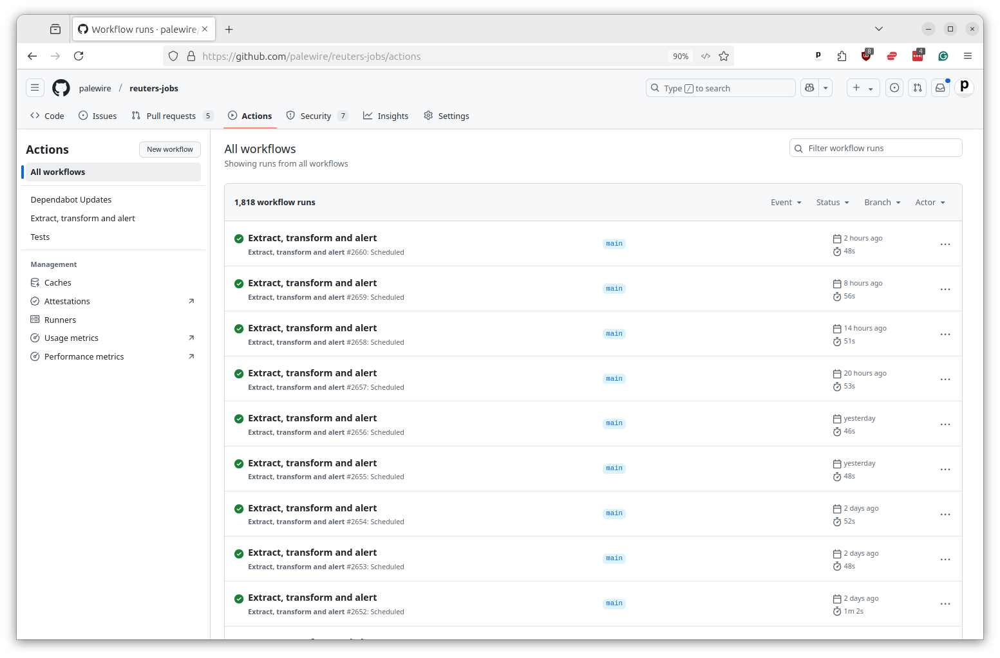

# Introducing GitHub Actions

Actions is an online tool to schedule, run and monitor computer programming scripts in a far-off data center without the need for human intervention. It is one of the commercial services offered by [GitHub](https://en.wikipedia.org/wiki/GitHub), Microsoft's multi-faceted software development site.

The tasks it executes are configured and run alongside the code that programmers store on the platform, allowing for quick and easy development. Due to its low cost and tight integration with the popular code-management system, Actions has emerged as one of the most popular automation tools.

The tool was created primarily to help coders with continuous integration and continuous deployment, jargon for a set of practices that automate the review, testing and circulation of freshly written code.

For example, a routine set of Actions is run to vet every change made to the codebase of Microsoft's [Visual Studio Code](https://github.com/microsoft/vscode), a popular open-source project managed via GitHub.

Each time a developer submits a patch for review, tests are run to ensure that nothing breaks. When changes have been approved, Actions can automatically ship out the latest version to users.

These routines are common in the software industry, where they are used to stengthen quality control and speed up releases.

However, Actions is not limited to these arcane, back-office tasks. Because it can be used to run any kind of script, computer programmers, including journalists, have found ways put Actions to all kinds of creative uses.

A simple example is the [@ReutersJobs](https://mastodon.palewi.re/@ReutersJobs) social media bot. The project scrapes the job listings from the Reuters website, identifies new openings, generates promotional images and posts notices to social media.

The bot's code is [hosted on GitHub](https://github.com/palewire/reuters-jobs) where Actions linked to the repository are configured to run a series of Python scripts every six hours, a process that is logged and monitored via [the repository's Actions tab](https://github.com/palewire/reuters-jobs/actions).

The panel allows you to see the progress of tasks as they execute and review the results of previous runs.

Reporters at top news organizations routinely use Actions to automate the collection, processing, analysis and publication of data. This class will teach you some of their techniques. We'll start with a simple example, then build up to more complex and powerful configurations.
